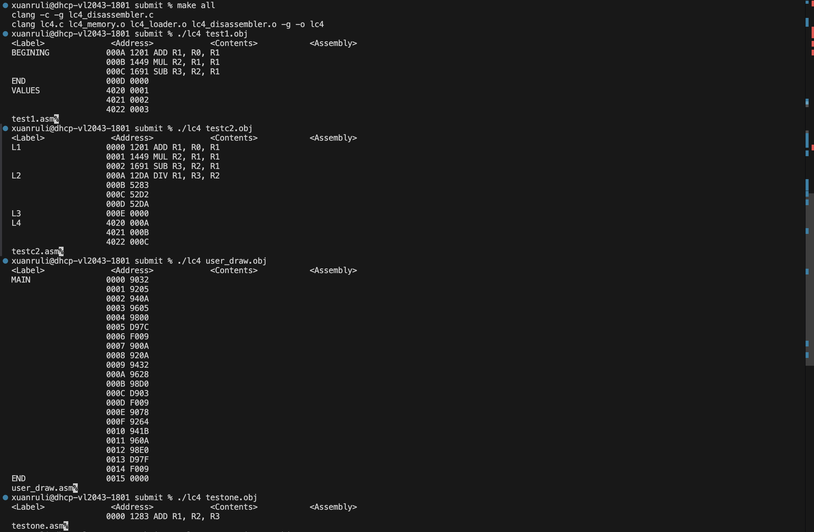
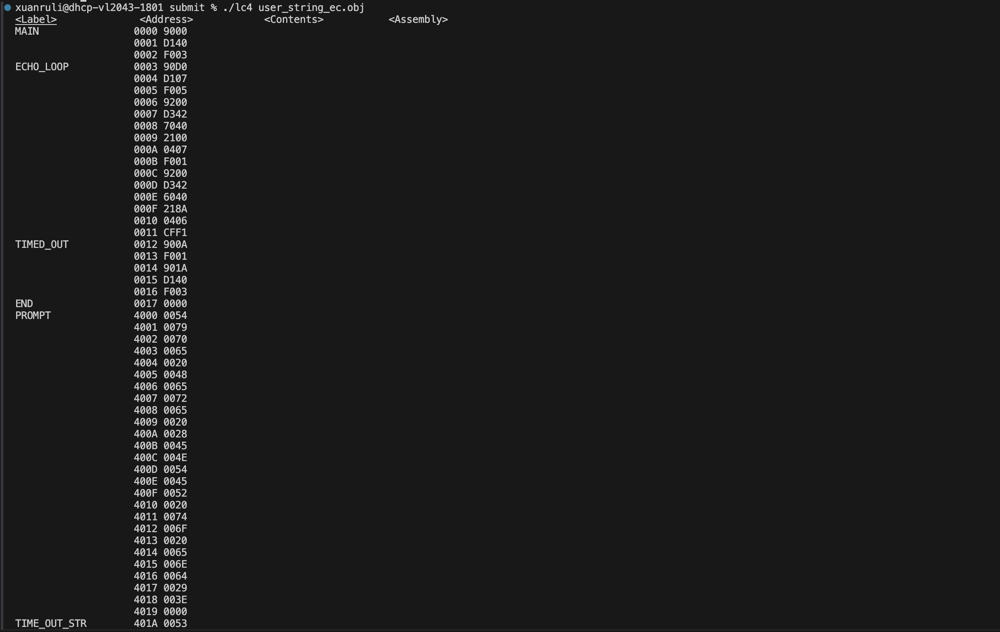

# Disassembler
Final project from computer system programming course
## Quick Intro
* Read and parsed object files generated by PennSim; implemented a reverse assembler to translate binary code into
assembly instructions conforming to the ISA
* Constructed and outputted a linked list representing the instruction in.obj file, which included binary contents, labels,
addresses, and assembly strings; completed the reverse assembler functionality to generate .asm files
* Wrote a Makefile to assist the compilation and linking of differents files; utilized valgrind to check dynamic memory
leak
## How to run
choose obj file from obj files for student testing folder, then:
```
cd submit
make all
./lc4 <file>.obj
```

## Expected Output

